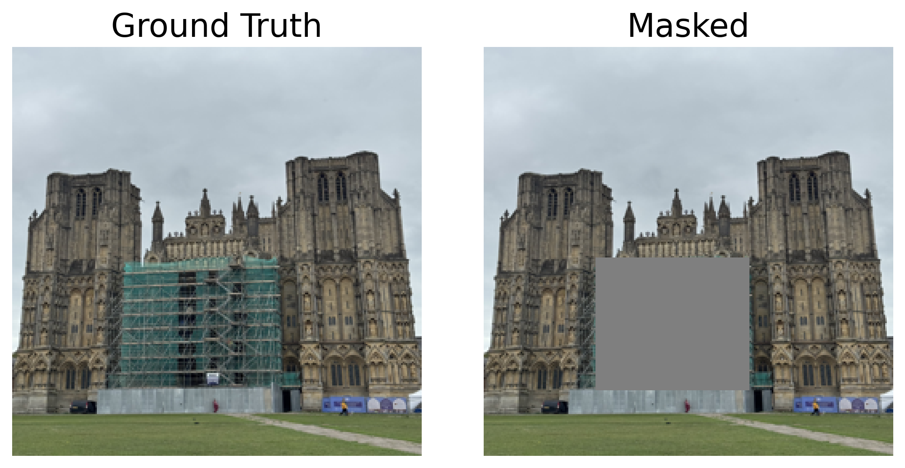
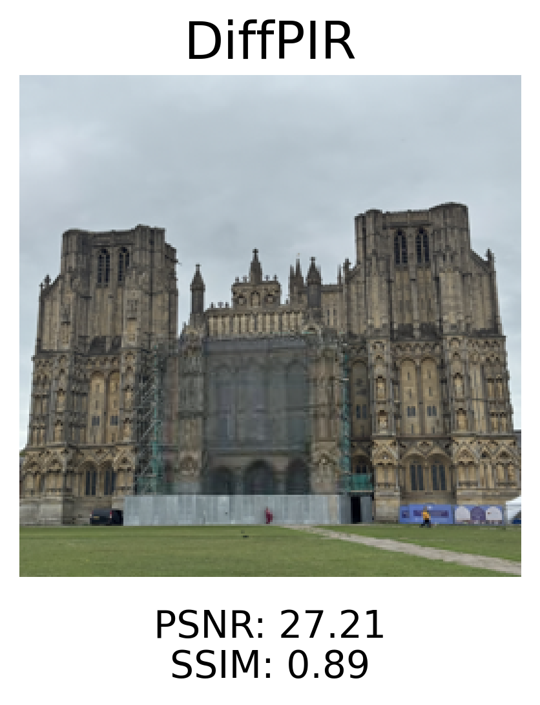
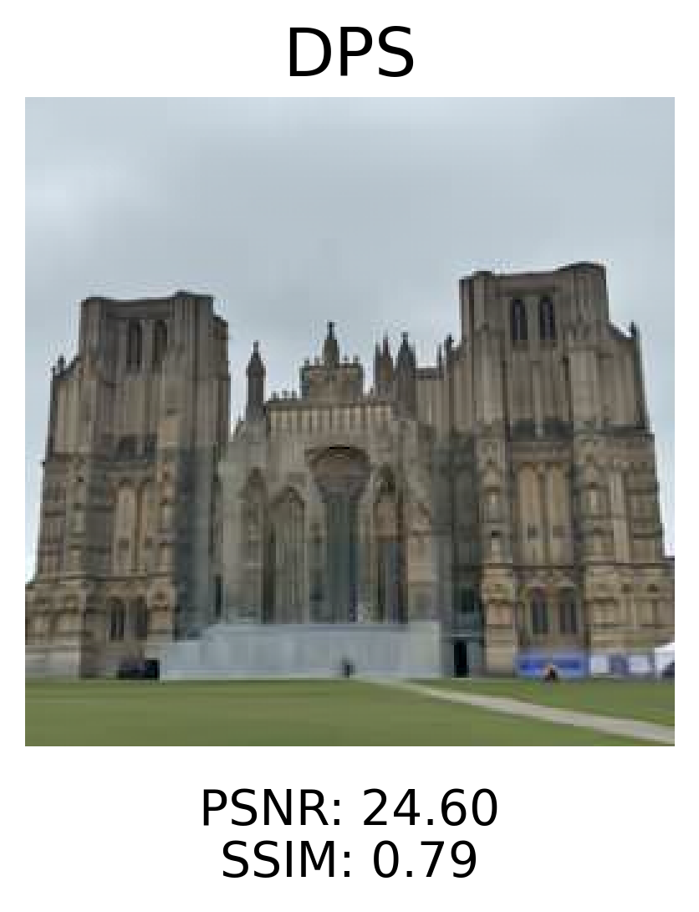
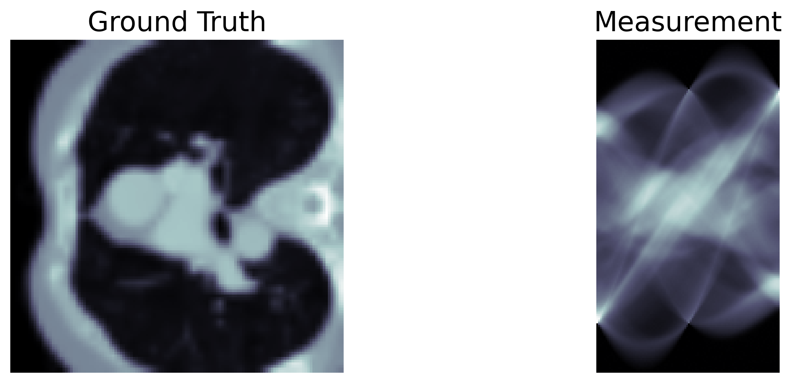
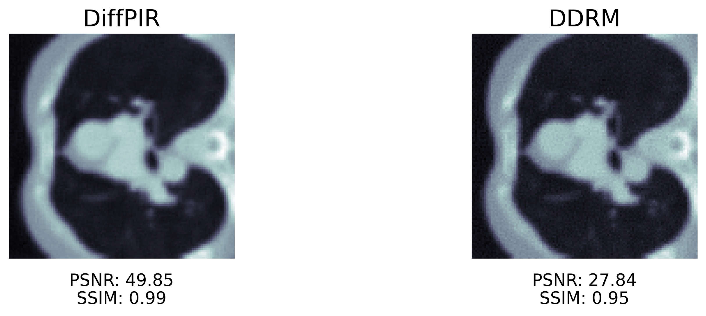

# Diffusion for Inverse Problems

This repository provides **implementations of state-of-the-art diffusion-based methods for solving inverse problems** in imaging, including **DiffPIR, DPS, DDRM, and RePaint**.

<p align="center">
  
  
  
</p>

<p align="center">
  
  
</p>

---

## ✨ Highlights

- 🧩 **Modular algorithms**: easily swap between DDPM/DDIM pipelines
- 🖼️ **Plug-and-play operators** for inpainting, tomography (CT), and deblurring
- 📓 **Prebuilt Jupyter notebooks** for fast experimentation
- 🔬 **Real-world applications**: object removal (like Apple Retouch/Google Magic Eraser), CT reconstruction, and image deblurring

---

## 🚀 Quick Start

```bash
# Clone the repository
git clone https://github.com/MohammadSadeghSalehi/diffusion-inverse-problems.git
cd diffusion-inverse-problems

# Install dependencies
pip install -r requirements.txt

# (Optional) Install in editable mode for development
pip install -e .

# Run demo notebook
jupyter notebook notebooks/demo_inpainting.ipynb
```

---

## 📚 Implemented Algorithms

| Algorithm | Description | Paper |
|-----------|-------------|-------|
| **DiffPIR** | Proximal gradient with diffusion priors | [Zhu et al., 2023](https://arxiv.org/pdf/2305.08995) |
| **DPS** | Diffusion posterior sampling for noisy inverse problems | [Chung et al., 2023](https://openreview.net/forum?id=OnD9zGAGT0k) |
| **DDRM** | DDPM/DDIM schedulers for image restoration | [Kawar et al., 2022](https://arxiv.org/pdf/2201.11793) |
| **RePaint** | Iterative inpainting with resampling | [Lugmayr et al., 2022](https://openaccess.thecvf.com/content/CVPR2022/papers/Lugmayr_RePaint_Inpainting_Using_Denoising_Diffusion_Probabilistic_Models_CVPR_2022_paper.pdf) |

---

## 📦 Repository Structure

```
diffusion-inverse-problems/
│
├── algorithms/              # Core algorithm implementations
│   ├── diffpir.py          # DiffPIR implementation
│   ├── dps.py              # DPS implementation
│   ├── repaint.py          # RePaint implementation
│   ├── ddrm.py             # DDRM implementation
│   └── __init__.py
│
├── physics/                # Forward model operators
│   ├── inpainting.py       # Inpainting masks and operators
│   ├── tomography.py       # CT reconstruction operators
│   ├── blur.py             # Blur kernels and deblurring
│   └── __init__.py
│
├── utils/                  # Utility functions
│   ├── dataset.py          # Dataset loaders (MRI, CelebA-HQ, etc.)
│   ├── degrade.py          # Image corruption operators
│   ├── visualization.py    # Plotting and visualization tools
│   └── __init__.py
│
├── notebooks/              # Example notebooks and demos
│   ├── demo_inpainting.ipynb
│   └── demo_tomography.ipynb
│
├── requirements.txt        # Python dependencies
├── README.md
└── LICENSE
```

---

## 📊 Example Usage

### Basic Inpainting Example

```python
import torch
import numpy as np
from diffusers import DDPMPipeline
import sys, os

# Adding project root (parent of notebooks/) to Python path
sys.path.append(os.path.abspath(os.path.join(os.getcwd(), "..")))

# === Imports from Repo ===
from algorithms.repaint import repaint
from utils.dataset import get_pipeline_and_dataset
from utils.degrade import degrade_dataloader
from utils.visualization import show_images
import deepinv as dinv
from physics.inpainting import InpaintingProblem

torch.manual_seed(0)

# === Device Selection ===
device = torch.device(
    "cuda" if torch.cuda.is_available()
    else "mps" if torch.backends.mps.is_available()
    else "cpu"
)

# === Load Pipeline and Dataset ===
pipeline, dataloader = get_pipeline_and_dataset(
    model_name="google/ddpm-celebahq-256",
    dataset_name="BSDS500",   # options: "CT", "CelebA-HQ", ...
    batch_size=1,
    img_size=256,
    subset_ratio=0.01,
    device=device
)

# === Problem Selection ===
problem = "inpainting"
img_size = (3, 256, 256)
noise_level = 0.0

if problem == "inpainting":
    mask = torch.ones(1, img_size[1], img_size[2])
    mask[:, 32:64, 32:64] = 0  # Example: square mask
    physics = InpaintingProblem(img_size=img_size, mask=mask, device=device)
else:
    raise ValueError(f"Unknown problem type: {problem}")

# === Define Forward and Pseudo-inverse Operators ===
A, A_pinv = physics.A, physics.A_dagger

# === Corrupt Dataset ===
noisy_dataloader = degrade_dataloader(dataloader, A, noise_std=noise_level, device=device)

# === Load One Sample (clean + corrupted) ===
sample_clean = next(iter(dataloader))
clean_img = sample_clean["image"].to(device) if isinstance(sample_clean, dict) else sample_clean[0].to(device)

sample_noisy = next(iter(noisy_dataloader))
y = sample_noisy[0].to(device)

# Save GT vs Corrupted for comparison
show_images(
    [(clean_img + 1) / 2, (y + 1) / 2],
    titles=["Ground Truth", "Corrupted"],
    save_path=os.path.join("results", f"{problem}_gt_corrupted.png")
)

# === Run RePaint ===
print(f"Running reconstruction for {problem} with RePaint...")
reconstructed_repaint = repaint(
    pipeline=pipeline,
    y=y,
    A=A,
    A_pinv=A_pinv,
    sigma_n=noise_level,
    num_inference_steps=250,
    jump_length=10,
    jump_n_sample=10,
)

# Save Result
show_images(
    [(clean_img + 1) / 2, (y + 1) / 2, (reconstructed_repaint + 1) / 2],
    titles=["Ground Truth", "Corrupted", "RePaint Reconstruction"],
    save_path=os.path.join("results", f"{problem}_reconstructed_repaint.png")
)
```

For complete examples, see the notebooks in `/notebooks/`.

---

## 🛠️ Supported Operations

- **Inpainting**: Remove unwanted objects, fill missing regions
- **CT Reconstruction**: Reconstruct medical images from sparse projections  
- **Deblurring**: Remove motion blur and camera shake
- **Super-resolution**: Enhance image resolution (coming soon)
- **MRI Reconstruction**: Reconstruct medical images from undersampled measurements (coming soon)

---

## 📋 Requirements

- Python 3.9+
- PyTorch 2.0+
- CUDA 11.0+ (for GPU acceleration), MPS support for non-CT problems
- Additional dependencies in `requirements.txt`

---

## 🤝 Contributing

We welcome contributions and:

- Report bugs and request features
- Submit pull requests
- Add new algorithms or operators
- Improve documentation

---

## 📚 References

### Algorithm Papers

**RePaint: Inpainting using Denoising Diffusion Probabilistic Models**
```bibtex
@inproceedings{lugmayr2022repaint,
  title={RePaint: Inpainting using Denoising Diffusion Probabilistic Models},
  author={Lugmayr, Andreas and Danelljan, Martin and Romero, Andres and Yu, Fisher and Timofte, Radu and Van Gool, Luc},
  booktitle={Proceedings of the IEEE/CVF Conference on Computer Vision and Pattern Recognition},
  pages={11461--11471},
  year={2022}
}
```

**Diffusion Posterior Sampling for General Noisy Inverse Problems**
```bibtex
@inproceedings{chung2023diffusion,
  title={Diffusion Posterior Sampling for General Noisy Inverse Problems},
  author={Chung, Hyungjin and Kim, Jeongsol and Mccann, Michael Thompson and Klasky, Marc Louis and Ye, Jong Chul},
  booktitle={The Eleventh International Conference on Learning Representations},
  year={2023},
  url={https://openreview.net/forum?id=OnD9zGAGT0k}
}
```

**Denoising Diffusion Models for Plug-and-Play Image Restoration**
```bibtex
@article{zhu2023denoising,
  title={Denoising Diffusion Models for Plug-and-Play Image Restoration},
  author={Zhu, Yuanzhi and Zhang, Kai and Liang, Jingyun and Cao, Jiezhang and Wen, Bihan and Timofte, Radu and Van Gool, Luc},
  journal={arXiv preprint arXiv:2305.08995},
  year={2023}
}
```

**Denoising Diffusion Restoration Models**
```bibtex
@article{kawar2022denoising,
  title={Denoising Diffusion Restoration Models},
  author={Kawar, Bahjat and Elad, Michael and Ermon, Stefano and Song, Jiaming},
  journal={arXiv preprint arXiv:2201.11793},
  year={2022}
}
```

---

## 📄 License

This project is licensed under the BSD 3-Clause License - see the [LICENSE](LICENSE) file for details.

---

## 🙏 Acknowledgments

- Thanks to the authors of the original papers for their groundbreaking work
- Special thanks to the open-source community for various code contributions
- Built with ❤️ for the computer vision, inverse problems, and machine learning community
